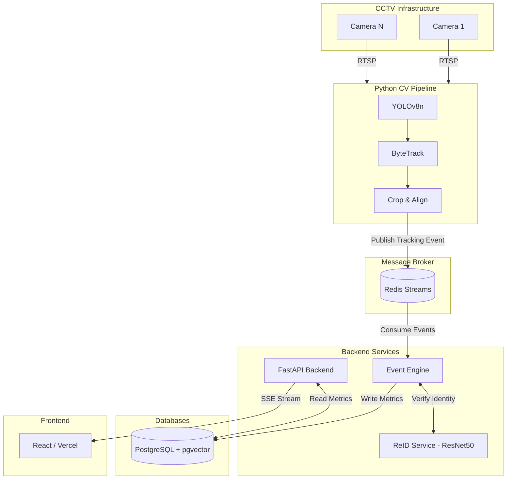

# Store Intelligence Architecture Design

This document describes the high-level architecture, data flows, and service responsibilities of the Store Intelligence system.

## 1. System Overview

The system processes real-time CCTV video streams through an AI-powered detection pipeline (YOLOv8 + ByteTrack), generates domain events via an event engine, and serves real-time analytics to a React dashboard.

It follows an **Event-Driven Microservices Architecture**, decoupling the heavy computer vision workload from the web API.

## 2. Architecture Diagram

## 3. Data Flow & Event Flow

1. **Video Ingestion:** `edge-node` pulls frames via OpenCV.
2. **Detection & Tracking:** YOLOv8 extracts bounding boxes. ByteTrack assigns a local `track_id`.
3. **Event Emission:** A JSON event (e.g., `TRACKING_UPDATE`) is pushed to a Redis Stream `store_events:<store_id>`.
4. **Event Consumption:** `event-engine` consumes the stream. 
5. **Re-Identification:** If a person crosses a critical zone (Entry/Exit), their cropped image tensor is sent to `reid-service` to generate a 2048d vector.
6. **State Persistence:** `event-engine` writes the session data to PostgreSQL.
7. **Client Streaming:** `backend-api` serves real-time aggregates to the frontend via Server-Sent Events (SSE).

## 4. Service Responsibilities

- **`edge-node`**: Raw video processing, tensor math, local tracking. Emits raw events. No knowledge of business logic or database schemas.
- **`event-engine`**: The brain of the operation. Parses raw events, calculates dwell times, coordinates with the ReID service to resolve identities, and persists state.
- **`reid-service`**: A stateless Python service that performs cosine similarity matching using pgvector. Accepts embeddings from edge-node, queries PostgreSQL for matching visitor identities.
- **`backend-api`**: A stateless FastAPI service handling CRUD operations, authentication (future), and SSE streaming.
- **`frontend-dashboard`**: React SPA (Vite) displaying metrics using Recharts.

## 5. Failure Handling

- **Redis Crash:** If Redis crashes, `edge-node` will cache events locally in memory up to a limit, then drop frames to prevent OOM.
- **PostgreSQL Crash:** `event-engine` will stall and cease ACKing messages in the Redis Consumer Group until the DB returns, ensuring zero event loss.
- **Camera Disconnect:** `edge-node` implements a robust reconnect loop (cv2.VideoCapture retries).

## 6. Scalability & Deployment

The current deployment is orchestrated via Docker Compose for local MVP validation.
For production scale:
- `edge-node` must be deployed on physical edge devices (e.g., NVIDIA Jetson Orin) inside the physical retail store.
- `backend-api`, `event-engine`, and `reid-service` scale horizontally in the cloud (Kubernetes).
- Redis and PostgreSQL are replaced with managed cloud offerings (Upstash/ElastiCache and Neon/RDS).
