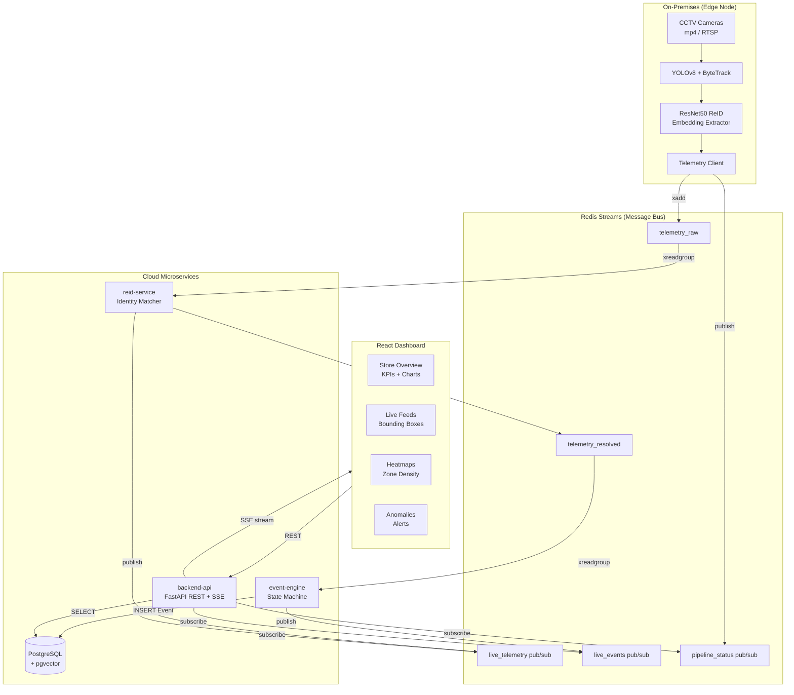

<div align="center">

# Store Intelligence Platform

**Real-time CCTV-based retail analytics powered by computer vision, identity re-identification, and event-driven microservices.**

[](https://python.org)
[](https://fastapi.tiangolo.com)
[](https://reactjs.org)
[](https://typescriptlang.org)
[](https://postgresql.org)
[](https://redis.io)
[](https://docker.com)
[](LICENSE)

[Live Demo](#) · [API Docs](#api-reference) · [Architecture](#architecture) · [Deployment Guide](#deployment)

</div>

---

## Overview

Store Intelligence is a **production-grade retail analytics platform** that transforms raw CCTV footage into actionable business intelligence — in real time.

It answers the questions every retail operator needs:
- **How many unique visitors** entered the store today?
- **Where do customers dwell** longest (heatmap)?
- **What is the conversion rate** from entry -> browse -> checkout?
- **Are there anomalies** in foot traffic or queue behaviour?

The platform processes video via an on-premises **Edge Node** (no footage leaves the building), routes anonymized telemetry through a **Redis Streams** pipeline, resolves individual identities using **biometric ReID** (ResNet50 + pgvector cosine similarity), and surfaces everything through a live **React dashboard** with Server-Sent Events.

---

## Features

| Feature | Description |
|---------|-------------|
| **Person Detection** | YOLOv8n with ByteTrack multi-object tracking at 2 FPS |
| **Identity Re-ID** | ResNet50 appearance embeddings (2048-d) matched via pgvector cosine similarity |
| **Zone Analytics** | Polygon-based spatial zones (Entry, Display, Queue, Aisle) |
| **Real-time Dashboard** | Live KPIs streamed via SSE — footfall, unique visitors, GMV, conversion |
| **Heatmap Overlay** | Normalized dwell time density per zone rendered on canvas |
| **Anomaly Detection** | Queue spike and abandonment rate heuristics |
| **Multi-Store** | Supports multiple store locations from a single deployment |
| **Event Sourcing** | Append-only PostgreSQL event log — full audit trail |
| **Fully Containerized** | Docker Compose one-command startup |

---

## Architecture



### Data Flow

```
CCTV Frame
  → YOLOv8 detects persons → ByteTrack assigns track IDs
  → ResNet50 extracts 2048-dim appearance embedding
  → telemetry_raw Redis Stream (raw telemetry + embedding)
  → reid-service: cosine similarity match → assigns visitor_id
  → telemetry_resolved Redis Stream (identity-resolved)
  → event-engine: spatial zone state machine → fires domain events
  → PostgreSQL events table (append-only log)
  → backend-api: SSE streams live data to React dashboard
```

---

## Microservices

| Service | Stack | Role | Port |
|---------|-------|------|------|
| `backend-api` | FastAPI + SQLAlchemy + asyncpg | REST API + SSE streaming, DB bootstrapper | 8000 |
| `reid-service` | asyncio + pgvector | Biometric identity resolution | — |
| `event-engine` | asyncio + Shapely | Zone state machine, event writer | — |
| `edge-node` | YOLOv8 + ByteTrack + ResNet50 | On-premises CV pipeline | — |
| `frontend-dashboard` | React 18 + TypeScript + Vite | Analytics dashboard | 80 / 5173 |

---

## Tech Stack

**Backend**
- **FastAPI** — async REST API with OpenAPI auto-documentation
- **SQLAlchemy 2.0** — async ORM with connection pooling
- **asyncpg** — high-performance async PostgreSQL driver
- **pgvector** — PostgreSQL extension for vector similarity search
- **Alembic** — database schema migrations
- **Redis Streams** — durable, ordered message queue between services
- **Pydantic v2 + pydantic-settings** — config validation & env loading

**Computer Vision**
- **YOLOv8n** (Ultralytics) — real-time person detection
- **ByteTrack** — state-of-the-art multi-object tracking
- **ResNet50** (PyTorch) — appearance embedding extractor for ReID (2048-d vectors)
- **OpenCV** — video capture and frame processing
- **Shapely** — polygon intersection for zone detection

**Frontend**
- **React 18** — UI framework
- **TypeScript** — type safety throughout
- **Vite** — blazing-fast build tooling
- **Vanilla CSS** — custom design system with dark mode + glassmorphism
- **Server-Sent Events (SSE)** — real-time live data without WebSocket complexity

**Infrastructure**
- **PostgreSQL 16 + pgvector** — primary datastore + vector similarity
- **Redis 7** — message bus (Streams) + real-time pub/sub
- **Docker + Docker Compose** — containerized orchestration
- **nginx** — production static file server for the React app
- **Railway** — recommended cloud deployment (backend)
- **Vercel** — recommended frontend deployment

---

## Quick Start (Docker Compose)

### Prerequisites
- [Docker Desktop](https://www.docker.com/products/docker-desktop/) 4.x+
- 8 GB RAM recommended (edge-node uses ~3 GB for PyTorch)
- Your CCTV footage (`.mp4` files) OR an RTSP stream URL

### 1. Clone and configure

```bash
git clone https://github.com/yourusername/store-intelligence.git
cd store-intelligence

# Create your environment file
cp .env.example .env

# Edit .env — at minimum, change POSTGRES_PASSWORD
nano .env  # or use your preferred editor
```

### 2. Add video footage

Place your CCTV `.mp4` files in a local directory. Update `.env`:

```bash
# Point to your footage directory
VIDEO_SOURCE_DIR=./my-footage

# Configure cameras (cam_id:/videos/filename.mp4)
CAMERA_LIST=cam-1:/videos/store_cam1.mp4,cam-2:/videos/store_cam2.mp4
```

> **No footage?** Start without the edge-node using demo/seeded data:
> ```bash
> docker compose up -d --scale edge-node=0
> ```

### 3. Start all services

```bash
# Start state layer + cloud services + frontend
docker compose up -d

# Watch logs
docker compose logs -f backend-api

# Check service health
docker compose ps
```

### 4. Access the platform

| Service | URL |
|---------|-----|
| Dashboard | http://localhost |
| API Docs (Swagger) | http://localhost:8000/api/v1/openapi.json |
| API Health | http://localhost:8000/health |

---

## Local Development (without Docker)

### Backend API

```bash
cd backend-api

# Create virtual environment
python -m venv venv
source venv/bin/activate  # Windows: venv\Scripts\activate

# Install dependencies
pip install -r requirements.txt

# Configure environment
cp .env.example .env
# Edit .env — set POSTGRES_SERVER=localhost, REDIS_URI=redis://localhost:6379/0

# Run (requires local Postgres + Redis)
uvicorn src.main:app --reload --port 8000
```

### Frontend Dashboard

```bash
cd frontend-dashboard

# Install dependencies
npm install

# Configure environment
cp .env.example .env
# Edit .env — set VITE_API_BASE_URL=http://localhost:8000/api/v1

# Start dev server
npm run dev
# → http://localhost:5173
```

### Running Individual Services

```bash
# Start only state layer (Postgres + Redis) via Docker
docker compose up -d postgres redis

# Then run any service locally against Docker state
cd event-engine
pip install -r requirements.txt
python -m src.main
```

---

## Environment Variables

### Root `.env` (used by Docker Compose)

| Variable | Required | Default | Description |
|----------|----------|---------|-------------|
| `POSTGRES_PASSWORD` | **Yes** | — | PostgreSQL password |
| `POSTGRES_USER` | No | `postgres` | PostgreSQL username |
| `POSTGRES_DB` | No | `store_intelligence` | Database name |
| `POSTGRES_SERVER` | No | `postgres` | DB host (service name) |
| `REDIS_URI` | No | `redis://redis:6379/0` | Redis connection URI |
| `BACKEND_CORS_ORIGINS` | No | `http://localhost:5173` | Allowed CORS origins |
| `VITE_API_BASE_URL` | No | `http://localhost:8000/api/v1` | Frontend -> Backend URL |
| `STORE_ID` | No | `a1b2c3d4-...` | Default store UUID |
| `CAMERA_LIST` | No | — | Edge node camera config |
| `VIDEO_SOURCE_DIR` | No | `./CCTV sources` | Host path to video files |
| `ENVIRONMENT` | No | `development` | App environment label |
| `LOG_LEVEL` | No | `INFO` | Log verbosity |

> Each service also has its own `.env.example` for standalone development.

---

## Deployment

### Recommended Architecture

```
                    ┌─────────────────┐
    Users ------->  │  Vercel (CDN)   │  React Dashboard
                    │  frontend-dash  │
                    └────────┬────────┘
                             │ HTTPS REST + SSE
                    ┌────────▼────────┐
                    │   Railway       │  backend-api (FastAPI)
                    │                 │  event-engine (daemon)
                    │                 │  reid-service (daemon)
                    │                 │  PostgreSQL + pgvector
                    │                 │  Redis
                    └─────────────────┘

    Your Premises:  edge-node (PyTorch CV) -> Redis Streams -> Railway
```

### Frontend -> Vercel

1. Push repository to GitHub
2. Go to [vercel.com](https://vercel.com) -> New Project -> Import from GitHub
3. Select the `frontend-dashboard` directory as the **Root Directory**
4. Add environment variable in Vercel dashboard:
   ```
   VITE_API_BASE_URL = https://your-backend.railway.app/api/v1
   ```
5. Deploy — Vercel auto-detects Vite and uses `vercel.json` for SPA routing

### Backend -> Railway

1. Go to [railway.app](https://railway.app) -> New Project -> Deploy from GitHub
2. Add services:
   - **PostgreSQL** plugin -> choose `pgvector/pgvector:pg16` image
   - **Redis** plugin
   - **backend-api** -> set Root Directory to `backend-api`
   - **event-engine** -> set Root Directory to `event-engine`
   - **reid-service** -> set Root Directory to `reid-service`
3. Set environment variables (copy from `.env.example`):
   ```
   POSTGRES_PASSWORD = <secure random string>
   POSTGRES_SERVER   = <railway postgres hostname>
   REDIS_URI         = <railway redis URL>
   BACKEND_CORS_ORIGINS = https://your-app.vercel.app
   ENVIRONMENT       = production
   ```
4. Deploy — Railway uses each service's `Dockerfile` automatically

### Edge Node (Local / On-Premises)

The edge node requires a machine with:
- 4+ GB RAM (for YOLOv8 + ResNet50 + OpenCV)
- Access to CCTV cameras (RTSP URL or local video files)
- Network connectivity to the Railway Redis instance

```bash
# .env for edge node (local)
REDIS_URI=redis://your-railway-redis-url:6379/0
STORE_ID=a1b2c3d4-0001-4000-8000-000000000001
CAMERA_LIST=cam-1:/videos/cam1.mp4

# Run
docker compose up edge-node
```

---

## API Reference

The backend-api auto-generates OpenAPI documentation:

- **Swagger UI**: `http://localhost:8000/docs`
- **ReDoc**: `http://localhost:8000/redoc`
- **OpenAPI JSON**: `http://localhost:8000/api/v1/openapi.json`

### Key Endpoints

| Method | Endpoint | Description |
|--------|----------|-------------|
| `GET` | `/health` | Service health check |
| `GET` | `/api/v1/stores/{id}/metrics` | Live KPI metrics |
| `GET` | `/api/v1/stores/{id}/funnel` | Conversion funnel |
| `GET` | `/api/v1/stores/{id}/heatmap` | Zone dwell heatmap |
| `GET` | `/api/v1/stores/{id}/anomalies` | Anomaly detection |
| `GET` | `/api/v1/dashboard/store/{id}` | Aggregated dashboard metrics |
| `GET` | `/api/v1/dashboard/store/{id}/stream` | **SSE live stream** |

---

## Screenshots

> Add screenshots of your running dashboard here.

```
dashboard-overview.png  — KPI cards + trend chart
heatmap-view.png        — Zone density overlay
live-feeds.png          — Real-time bounding box tracking
anomalies.png           — Alert cards
```

---

## Future Improvements

- [ ] **GPU acceleration** — CUDA support for edge-node (10× faster processing)
- [ ] **Dwell time tracking** — Precise per-visitor dwell via EXIT event pairing
- [ ] **Dashboard authentication** — JWT + OAuth2 login for multi-tenant access
- [ ] **Alerting** — Webhook/email notifications for anomaly events
- [ ] **Historical replay** — Reprocess past footage against updated zone definitions
- [ ] **Kubernetes** — Helm chart for production-scale multi-edge deployment
- [ ] **ML anomaly detection** — Replace heuristics with Isolation Forest / LSTM
- [ ] **Alembic migrations** — Version-controlled schema evolution in CI/CD
- [ ] **OpenTelemetry** — Distributed tracing across all microservices
- [ ] **Mobile app** — React Native companion for on-floor managers

---

## Contributing

Contributions are welcome! Please:

1. Fork the repository
2. Create a feature branch: `git checkout -b feature/amazing-feature`
3. Commit your changes: `git commit -m 'feat: add amazing feature'`
4. Push to the branch: `git push origin feature/amazing-feature`
5. Open a Pull Request

---

## License

This project is licensed under the **MIT License** — see the [LICENSE](LICENSE) file for details.

---

<div align="center">
Built for retail analytics

Star this repo if you found it useful!
</div>
